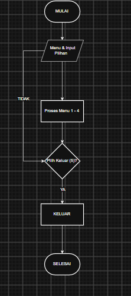
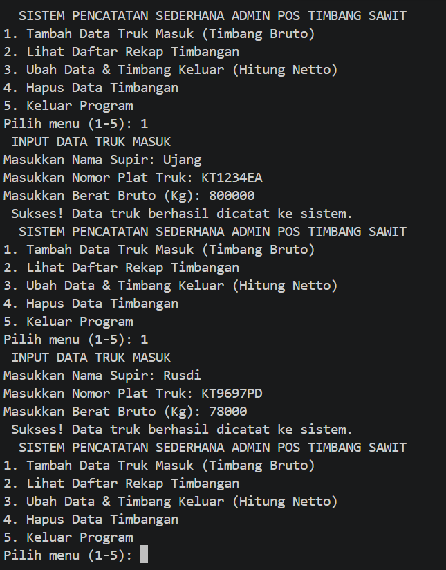
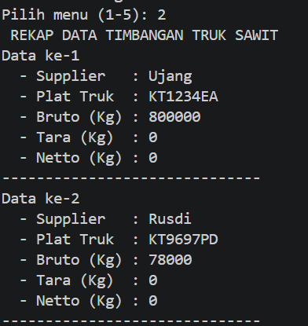
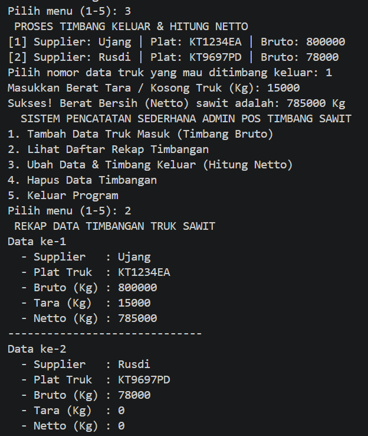
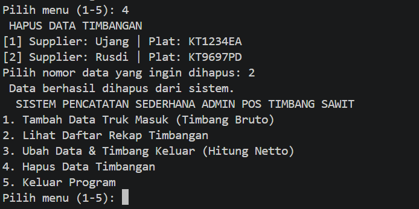
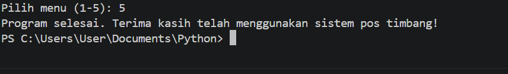

Sistem Pencatatan Sederhana Admin Pos Timbang Sawit

Program untuk admin pos timbang kelapa sawit dalam mendata truk masuk, menghitung berat bersih (netto) secara otomatis saat truk keluar, serta mengelola data transaksi menggunakan struktur data list dan tuple.

(Flowchart)
Berikut adalah flowchart alur kerja program:

Mulai (START): Titik awal program dijalankan.
Menu & Input Pilihan (Jajar Genjang): Program menampilkan pilihan menu utama (angka 1 sampai 5) kepada pengguna, lalu pengguna mengetikkan pilihannya.
Proses Menu 1 - 4 (Persegi Panjang): Berdasarkan angka yang dipilih user, program akan mengeksekusi fungsi tertentu:
Menu 1: Menambah data truk masuk (nama, plat, bruto).
Menu 2: Menampilkan rekap seluruh data.
Menu 3: Memproses truk keluar, menginput tara, dan menghitung netto otomatis.
Menu 4: Menghapus data berdasarkan nomor urut.
Pilih Keluar (5)? (Belah Ketupat / Decision): Pengecekan kondisi perulangan while.
Jika Tidak, alur akan berputar kembali ke atas menuju menu pilihan untuk mengulang program.
Jika Ya, alur akan dilanjutkan ke bawah menuju proses keluar program.
Keluar & Selesai: Program mencetak pesan penutup, menghentikan perulangan (break), dan program berhenti (STOP).

Dokumentasi Screenshot Output Program

1. Menu Utama & Input Data Truk Masuk (Menu 1)
> Menunjukkan menu utama aplikasi dan proses input data awal truk masuk (nama supir, plat truk, dan berat bruto).

2. Rekap Data Timbangan (Menu 2)
> Menampilkan seluruh data truk yang sudah dimasukkan dalam bentuk daftar terstruktur ke bawah.

3. Proses Timbang Keluar & Hitung Netto (Menu 3)
> Proses admin menginput berat tara (kosong) truk dan sistem otomatis menghitung berat bersih (netto).

4. Hapus Data Timbangan (Menu 4)
> Proses menghapus data transaksi dari sistem berdasarkan nomor urut data.

5. Keluar Program (Menu5)
>  Proses Keluar Dari Program

